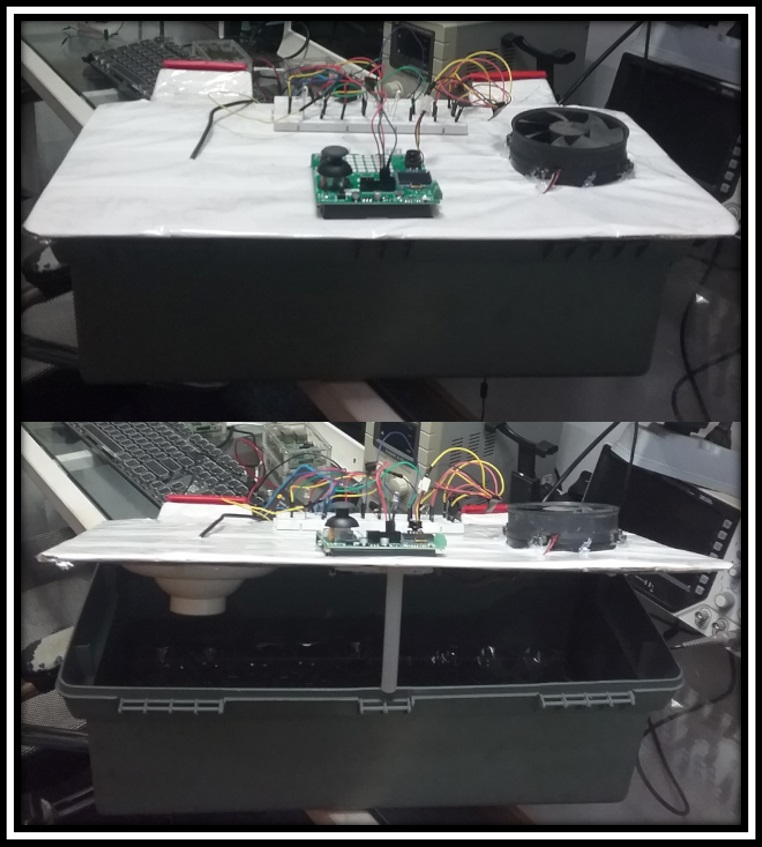

# Observação importante:
Pode ser necessário algumas alterações no arquivo CMakeLists.txt, haja visto que cada instalação
do ambiente segue características individuais de cada projetista. Sem essas alterações o
código pode não apresentar o comportamento desejado!

A instalação utilizada para construção desta solução, bem como dos testes segue a lógica a seguir:

## Em Construção...

Diferenças entre PT100 e LM35:
- PT100: É um termorresistor (RTD) que varia sua resistência elétrica conforme a temperatura.
Requer um circuito de condicionamento de sinal, geralmente um circuito de Ponte de Wheatstone e um amplificador operacional para converter a variação de resistência em tensão legível pelo ADC. No Raspberry Pi Pico, ele não pode ser lido diretamente pelo ADC sem um circuito adicional.

- LM35: É um sensor de temperatura analógico que fornece uma saída de tensão linear proporcional à temperatura (10 mV/°C).
Pode ser lido diretamente pelo ADC do Pico sem necessidade de circuitos adicionais.

O LM35 pode ser conectado diretamente ao GP28 e ser lido pelo ADC.
Já o PT100 não pode ser lido diretamente, pois precisa de um circuito de interface para converter resistência em tensão.
___
# 🚀 **Apresentação do projeto.**

## 🐣 Eclo Piu-Piu Advanced DMA

Este projeto visa o desenvolvimento de um sistema avançado de controle térmico para incubação de ovos, utilizando um **Raspberry Pi Pico W – Bitdoglab** e técnicas modernas de **DMA (Direct Memory Access) com ADC (Analog-to-Digital Converter)**.

## 🚀 Objetivo do Projeto
O sistema é projetado para pequenos criadores e uso doméstico, garantindo **controle preciso da temperatura** dentro da incubadora. O diferencial desta versão é a utilização do **DMA**, que permite leituras contínuas e eficientes do sensor **PT100**, otimizando a precisão da temperatura e reduzindo a carga da CPU.

## 🔥 Principais Características
- ✅ **Leitura avançada de temperatura**: Uso do **DMA com ADC** para obter leituras de temperatura em alta resolução sem comprometer o desempenho do microcontrolador.
- ✅ **Controle térmico otimizado**: Algoritmo PID ajustável para acionamento de uma resistência elétrica via **PWM**, proporcionando um aquecimento gradual e preciso.
- ✅ **Monitoramento contínuo**: Exibição de temperatura em tempo real em um **display OLED 128x64**.
- ✅ **Automação Inteligente**: Controle de uma ventoinha para circulação de ar e resfriamento quando necessário.
- ✅ **Capacidade**: Incubadora compacta com espaço para **36 ovos**, medindo **20cm de altura, 15cm de largura e 45cm de comprimento**.

## 🛠️ Diferencial: Uso do DMA com ADC
O uso do **DMA** elimina a necessidade de leitura manual do **ADC**, permitindo que os dados de temperatura sejam capturados continuamente e armazenados na memória sem intervenção da CPU. Isso melhora a **precisão** e **eficiência** do controle térmico, garantindo uma incubação mais estável e confiável.

🔄 Reutilização de Código e Eficiência

A transição do código sem DMA para com DMA foi facilitada pela separação de responsabilidades, trazendo várias vantagens:

- ✅ **Facilidade de Adaptação – A lógica existente foi aproveitada e adaptada para DMA sem grandes mudanças.**
- ✅ **Manutenção Simples – O código modular permite que futuras melhorias sejam feitas sem refatorações extensas.**
- ✅ **Escalabilidade – Suporte fácil para novos sensores (ex: NTC, termopares) sem afetar a estrutura principal.**
- ✅ **Maior Eficiência – Com DMA coletando as amostras automaticamente, a CPU fica livre para outras tarefas, reduzindo o consumo de energia.**

## 🔧 Seleção do Sensor via Diretiva de Pré-Processamento

O código permite a seleção do sensor utilizado através de uma diretiva:

```C++
#define USE_PT100 1 // 1 para PT100, 0 para LM35

float get_temperature_from_dma()
{
    uint32_t sum = 0;
    for (int i = 0; i < ADC_BUFFER_SIZE; i++)
    {
        sum += adc_buffer[i];
    }
    float avg_raw = sum / (float)ADC_BUFFER_SIZE;
    float voltage = avg_raw * (3.3f / (1 << 12));

#if USE_PT100
    return voltage * 100.0f; // Conversão para temperatura (PT100)
#else
    return (voltage - 0.5f) * 100.0f; // Conversão para temperatura (LM35)
#endif
}
```
## 📜 Conclusão

O uso de DMA trouxe uma melhoria significativa no desempenho da incubadora, tornando o sistema mais eficiente e preparado para futuras expansões. 🔥🚀

## 📷 Imagem do Projeto


___

## 🛠 **Desenvolvido por Antonio Almeida**  
📌 *Contribuições são bem-vindas! Sinta-se à vontade para abrir um PR ou relatar issues.* 🚀

___

### 📝 **O código foi desenvolvido em C/C++ e testado no ambiente Bitdoglab.**

### 🔧 **Status**

 🚧 Testado 🟢
___

### 📋 **Lista de Testes que contribuiram para a criação do projeto:**

- 🟢 Teste 0001 - blink_bdl
- 🟢 Teste 0002 - button_buzzer_bdl
- 🟢 Teste 0003 - blink_rgb_bdl
- 🟢 Teste 0004 - buzzer_bdl
- 🟢 Teste 0005 - ssd1306_bdl
- 🟢 Teste 0006 - goertzel_bdl
